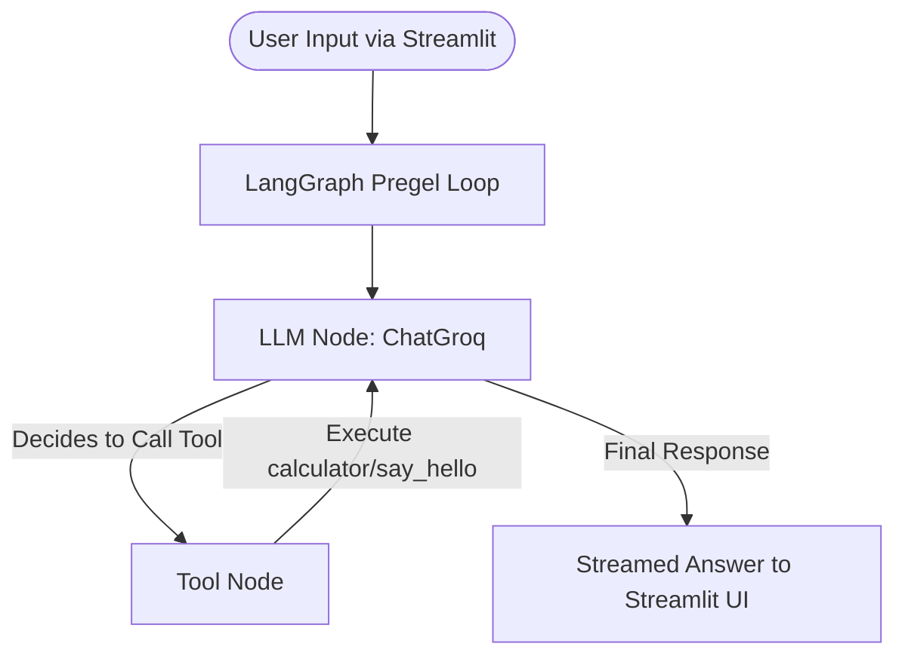

# Grok AI Assistant (Groq & LangGraph Streamlit App)

A stateful, tool-equipped web chatbot built using **LangGraph**, **LangChain**, and the **Groq API**, wrapped in a modern **Streamlit** user interface. The chatbot operates on a ReAct (Reasoning and Acting) architecture, enabling it to call external tools to answer user queries, stream responses in real-time, and show tool execution logs step-by-step.

---

## ✨ Features

- **Interactive Web UI**: A clean, responsive Streamlit-based interface for conversational interaction.
- **Dynamic Model Selection**: Choose between multiple free tier Groq models directly from the sidebar:
  - `qwen/qwen3.6-27b` (Default)
  - `llama-3.3-70b-versatile`
  - `llama-3.1-8b-instant`
  - `gemma2-9b-it`
- **Adjustable Temperature**: Control creativity and determinism with an intuitive sidebar slider.
- **Real-Time Streaming**: Watch the assistant's response stream in live as it generates.
- **Visual Tool Execution**: Status updates and expander cards show the live execution, inputs, and outputs of tools run by the agent.
- **Session History Management**: Seamlessly maintain chat history during your session, with a one-click button to clear context.

---

## 🏗️ Architecture

The application is built on the **ReAct (Reasoning and Acting) Agent** pattern using **LangGraph**'s prebuilt agent executor. 



### Key Architectural Components
1. **State Management (LangGraph):** Manages the conversation flow as a state graph, keeping track of the message history.
2. **LLM Node (ChatGroq):** Evaluates user input and determines whether it can reply directly or if it needs to call a tool.
3. **Tool Node:** Executes custom Python functions when requested by the model and feeds the results back to the model.

---

## 🛠️ Tools Available to the Agent

The chatbot has access to two custom-defined tools in [`main.py`](file:///c:/Users/sirisha/sirisha/gemin-gork/main.py):
* **`calculator`**: Handles basic arithmetic operations (`a + b`).
* **`say_hello`**: Provides a friendly, personalized greeting to the user.

---

## 🔄 Workflow

1. **Initialization**: The application loads the environment variables (API keys and model configuration) and initializes the ChatGroq model and tools.
2. **User Interaction**: The user enters a prompt in the Streamlit chat input.
3. **Execution**: The input is wrapped in a `HumanMessage` and passed to `agent_executor.stream()`.
4. **Streaming & Tool Tracking**: As the graph executes, any tool calls are displayed in real-time status blocks, and the text responses are streamed progressively to the chat UI.
5. **Session Persistency**: Message history and tool logs are saved to the Streamlit `session_state`.

---

## 🚀 Project Startup & Installation

Follow these steps to set up and run the project locally.

### Prerequisites
* Python 3.9 or higher installed.

### 1. Set Up the Virtual Environment
Create a virtual environment:
```bash
python -m venv .venv
```

Activate the virtual environment:
* **Windows (PowerShell)**:
  ```powershell
  Set-ExecutionPolicy -ExecutionPolicy Bypass -Scope Process
  .venv\Scripts\Activate.ps1
  ```
* **Windows (CMD)**:
  ```cmd
  .venv\Scripts\activate.bat
  ```
* **Linux/macOS**:
  ```bash
  source .venv/bin/activate
  ```

### 2. Install Dependencies
Install all required libraries specified in [`requirements.txt`](file:///c:/Users/sirisha/sirisha/gemin-gork/requirements.txt):
```bash
pip install -r requirements.txt
```

### 3. Configure Environment Variables
Create a file named [`.env`](file:///c:/Users/sirisha/sirisha/gemin-gork/.env) in the root directory and add your Groq credentials. You can copy from [`.env.example`](file:///c:/Users/sirisha/sirisha/gemin-gork/.env.example):
```bash
cp .env.example .env
```

And update the values in your [`.env`](file:///c:/Users/sirisha/sirisha/gemin-gork/.env) file:
```env
GROQ_API_KEY=your_groq_api_key_here
GROQ_MODEL=qwen/qwen3.6-27b
```

### 4. Run the Application

Start the Streamlit application:
```bash
streamlit run main.py
```
This will launch the web application and open it in your default browser (usually at `http://localhost:8501`).

---

## 🌐 Deployment to Streamlit Community Cloud

You can deploy this application for free on [Streamlit Community Cloud](https://streamlit.io/cloud) by following these steps:

1. **Push your changes to GitHub**:
   Ensure all your latest files (including [`requirements.txt`](file:///c:/Users/sirisha/sirisha/gemin-gork/requirements.txt) and [`main.py`](file:///c:/Users/sirisha/sirisha/gemin-gork/main.py)) are committed and pushed to your GitHub repository:
   ```bash
   git add .
   git commit -m "Prepare for Streamlit Cloud deployment"
   git push origin main
   ```

2. **Sign in to Streamlit Community Cloud**:
   - Go to [share.streamlit.io](https://share.streamlit.io/).
   - Click **Connect GitHub account** and log in.

3. **Deploy the App**:
   - Click the **"New app"** button.
   - Choose your repository: `sirishahk008/grok-ai-assistant`.
   - Set the Branch to `main`.
   - Set the Main file path to `main.py`.

4. **Configure Secrets & Environment Variables**:
   Streamlit Community Cloud does not read local `.env` files for security reasons. Instead:
   - Click **Advanced settings...** at the bottom of the deployment setup.
   - In the **Secrets** section, add your environment variables in TOML format:
     ```toml
     GROQ_API_KEY = "your_actual_groq_api_key_here"
     GROQ_MODEL = "qwen/qwen3.6-27b"
     ```
   - Click **Save**.

5. **Deploy**:
   - Click **Deploy!**. Streamlit will set up the container, install libraries from [`requirements.txt`](file:///c:/Users/sirisha/sirisha/gemin-gork/requirements.txt), and launch your app.

