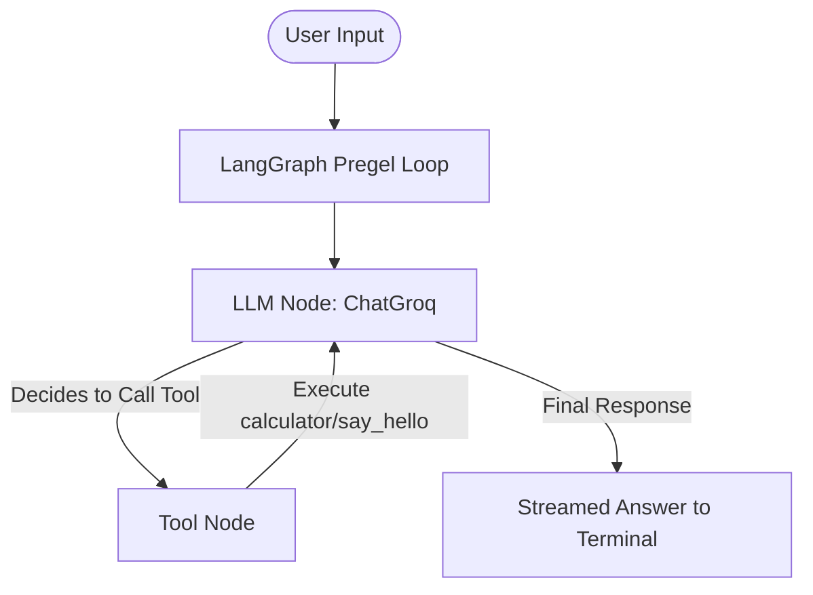

# Python AI Chatbot (Groq & LangGraph)

A stateful, tool-equipped CLI chatbot built using **LangGraph**, **LangChain**, and the **Groq API**. The chatbot operates on a ReAct (Reasoning and Acting) architecture, enabling it to call external tools to answer user queries and stream responses in real-time.

---

## 🏗️ Architecture

The application is built on the **ReAct (Reasoning and Acting) Agent** pattern using **LangGraph**'s prebuilt agent executor. 



### Key Architectural Components
1. **State Management (LangGraph):** Manages the conversation flow as a state graph, keeping track of the message history.
2. **LLM Node (ChatGroq):** Evaluates user input and determines whether it can reply directly or if it needs to call a tool.
3. **Tool Node:** Executes custom Python functions when requested by the model and feeds the results back to the model.

---

## 🛠️ Tools Available to the Agent

The chatbot has access to two custom-defined tools:
* **`calculator`**: Handles basic arithmetic operations (`a + b`).
* **`say_hello`**: Provides a friendly, personalized greeting to the user.

---

## 🔄 Workflow

1. **Initialization**: The application loads the environment variables (API keys and model configuration) and initializes the ChatGroq model and tools.
2. **User Input Loop**: The CLI prompts the user for input in a continuous loop.
3. **Execution**: The user's input is wrapped in a `HumanMessage` and passed to `agent_executor.stream()`.
4. **Streaming**: As the graph executes, the agent streams intermediate states (message chunks) to the terminal, giving a real-time responsive UI.
5. **Termination**: The loop runs indefinitely until the user types `quit`.

---

## 🚀 Project Startup & Installation

Follow these steps to set up and run the project locally.

### Prerequisites
* Python 3.9 or higher installed.

### 1. Set Up the Virtual Environment
Create a virtual environment:
```bash
python -m venv .venv
```

Activate the virtual environment:
* **Windows (PowerShell)**:
  ```powershell
  Set-ExecutionPolicy -ExecutionPolicy Bypass -Scope Process
  .venv\Scripts\Activate.ps1
  ```
* **Windows (CMD)**:
  ```cmd
  .venv\Scripts\activate.bat
  ```
* **Linux/macOS**:
  ```bash
  source .venv/bin/activate
  ```

### 2. Install Dependencies
Install all required libraries specified in [`requirements.txt`](file:///c:/Users/sirisha/sirisha/gemin-gork/requirements.txt):
```bash
pip install -r requirements.txt
```

### 3. Configure Environment Variables
Create a file named [`.env`](file:///c:/Users/sirisha/sirisha/gemin-gork/.env) in the root directory and add your Groq credentials:
```env
GROQ_API_KEY=your_groq_api_key_here
GROQ_MODEL=llama-3.1-8b-instant
```

### 4. Run the Application

Start the Streamlit application:
```bash
streamlit run main.py
```
This will launch the web application and open it in your default browser (usually at `http://localhost:8501`).
